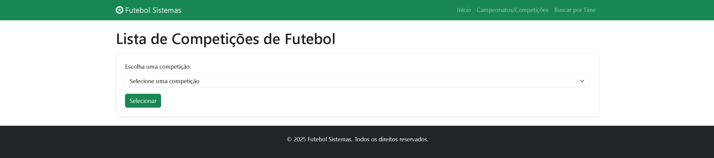
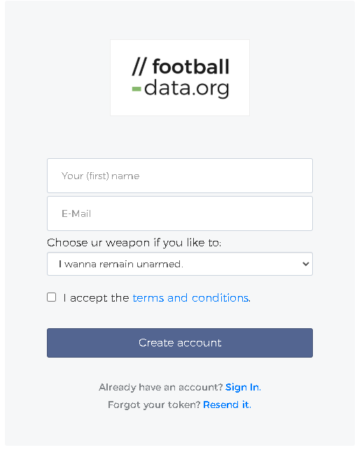
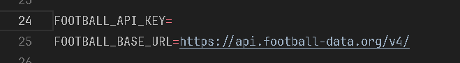

# Sistema de Futebol



### Como rodar o projeto:

0. **Clone o projeto**
    ```bash
    git clone https://github.com/caiobarbosa881/sistema_futebol.git
    ```
1. **Primeiramente, vamos pegar nossa API KEY**

    Se registre em: [football-data.org](https://www.football-data.org/client/register)

    

    Após se registrar copie a API KEY fornecida pelo site.

2. **Configurar o arquivo `.env`**

    Execute no terminal:

    ```bash
    cp .env.example .env
    ```

    Na linha 24 do `.env` gerado coloque sua chave API em `FOOTBALL_API_KEY`:

    

3. **Execute os comandos em sequência para garantir que o projeto vai rodar:**

    ```bash
    composer install
    php artisan key:generate
    php artisan migrate
    php artisan serve
    ```

4. **Qualquer dúvida entrar em contato!:**
